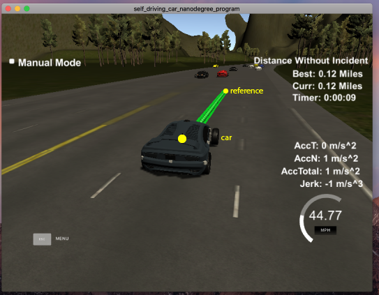
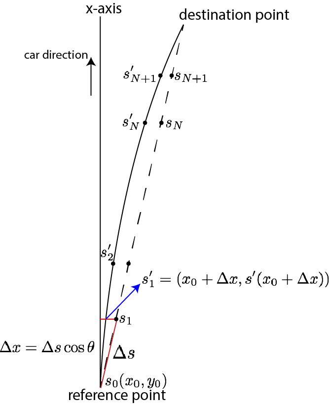

# CarND-Path-Planning-Project


## Aim of this project

In this project your goal is to safely navigate around a virtual highway with other traffic that is driving +-10 MPH of the 50 MPH speed limit. You will be provided the car's localization and sensor fusion data, there is also a sparse map list of waypoints around the highway. The car should try to go as close as possible to the 50 MPH speed limit, which means passing slower traffic when possible, note that other cars will try to change lanes too. The car should avoid hitting other cars at all cost as well as driving inside of the marked road lanes at all times, unless going from one lane to another. The car should be able to make one complete loop around the 6946m highway. Since the car is trying to go 50 MPH, it should take a little over 5 minutes to complete 1 loop. Also the car should not experience total acceleration over 10 m/s^2 and jerk that is greater than 50 m/s^3.


## Outline of the approach

My path planning algorithm is based on the [finite-state machine](https://en.wikipedia.org/wiki/Finite-state_machine) approach. These states are:

- Staying on the middle lane
- Staying on the right lane
- Staying on the left lane
- Stopping

In the first three states. the car will try to reach the desired speed (44 MPH or 20/ms).
At an instant, the car reads the car's localization and the sensor fusion data to determine whether is should staying on its lane, switch to a adjacent lane, or reduce its speed.


## Evaluate the cost function

The cost function is in the following form:

L(state)=C1/(time to next possible collision)+C2(desired_speed-current_speed).

C1 and C2 are coefficients that can be altered to achieve the most desirable results.


### Predict the next collision
I use the localization data (x, y, vx, vy) given by ```sensor_fusion``` to calculate the time that a collision would happen for each state.
This assumes the adjacent cars moves in a constant speed.


## Generate the trajectory

The car trajectory in the this implementation is mainly generated by spline fitting. This is easy to implement and very efficient.




The fitting comprises of the following steps:

- Select the end point of the remain trajectory as the **reference point**
- Find the coming map way points after this reference point.
- Convert these waypoints from global coordinates to car reference coordinates.
- Starting from the reference point. Estimate an appropriate length of segment to the next point, say $\Delta s$.
- Calculate the x coordinate that x+\Delta x map on.
- Find the y coordinate from the fitted spline. See the following figure.



- Convert the trajectory from car reference coordinates back to global coordinates.

Note that acceleration is included in the generation of trajectory.
For each interval, the instaneous speed of the car is recalculated, using the following iterative equations:


where v_{N} and v_{N+1} are the instaneous speed of the car at the N-th and (N+1)-th step, repectively, whereas x_{N+1} is the car position and the N-th step.


## Possible improvement ideas

- Evalulate the states using the [Markov decision process](https://en.wikipedia.org/wiki/Markov_decision_process): the current implementation chooses the next state with the lowest cost. This is essentially a Greedy approach. It would be interesting to search the deeper states to make the car more intelligent.


